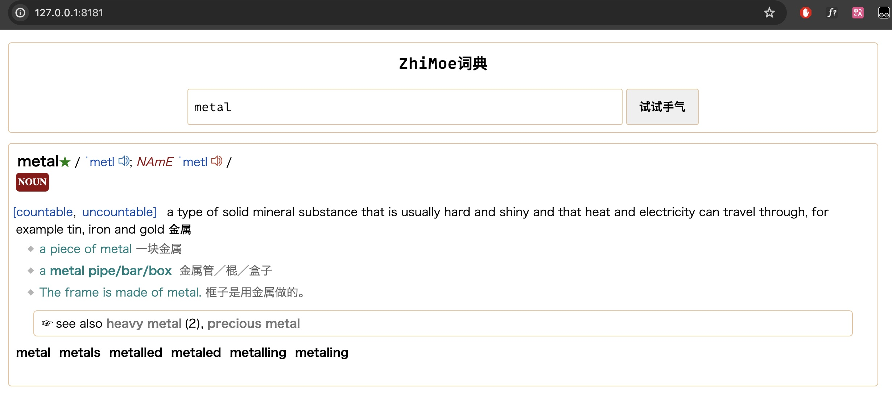

# mdict-rs

a simple web dictionary write in rust, base on mdx format dictionary file.
it's at an early stage of development, now only support mdx version 2.0 with encrypted=2 or 0

## usage

1. put your mdx file in `resources/mdx/en` folder ando config `src/config/mod.rs`
2. if your mdx file has separate css file, put it in `resources/static/` folder
3. run

```bash
cargo run --bin mdict-rs
# now open your chrome, and search
# http://localhost:8181
``` 

## screenshot



## 参考

MDX的解析功能和mdx文件规范参考[mdict-analysis](https://bitbucket.org/xwang/mdict-analysis/src/master/)
和文章[MDX/MDD 文件格式解析](http://einverne.github.io/post/2018/08/mdx-mdd-file-format.html)
