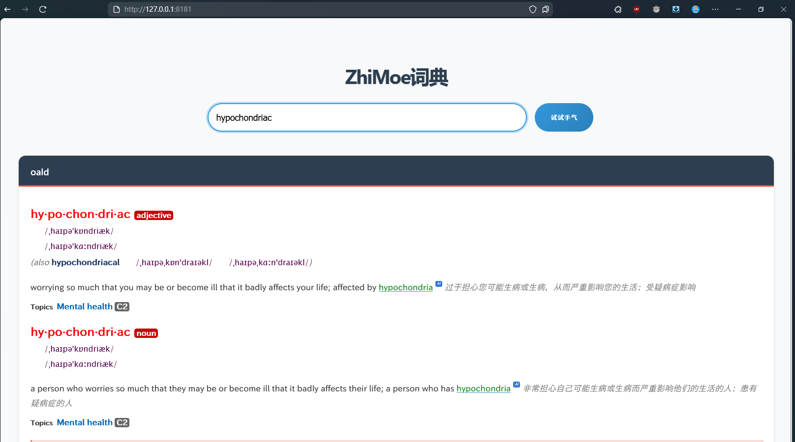

# mdict-rs

a simple web dictionary write in rust, base on mdx format dictionary file.
it's at an early stage of development, now only support mdx version 2.0 with encrypted=2 or 0

## Usage

1. Copy your dictionary file (.db or .mdx) to the resources/dict directory. To specify a custom location, use the -d flag when launching the application.
   > Tip: After database generation completes, you can safely remove the original .mdx file. For deployment preparation, use the -g flag to generate the database file locally first.
2. If your MDX file has a corresponding CSS stylesheet, place it in the same dictionary folder.
3. Launch the application.

```bash
./mdict-rs
# now open your chrome, and search
# http://localhost:8181
```

## Screenshot



## 参考

MDX的解析功能和mdx文件规范参考[mdict-analysis](https://bitbucket.org/xwang/mdict-analysis/src/master/)
和文章[MDX/MDD 文件格式解析](http://einverne.github.io/post/2018/08/mdx-mdd-file-format.html)
